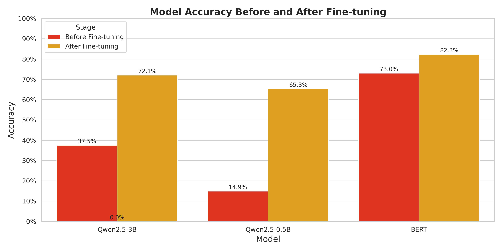

# Project Evaluations (Sort version)

#### Dataset construction
Though we choose to work on closed and not publicly available data, we also want to explain how this project works, thus sample data is provided to help readers better understand our approach.
./pre_process/labeled_v2.csv.txt and ./pre_process/unlabeled_v2.csv.txt are sample data from labeled_v2.csv and unlabeled_v2.csv where the full data is located.
Based on the labeled data, we have 70% train + 20% test + 10% validation split for the setup.

```
$ wc test.csv train.csv validation.csv 
   14850    14915  4528171 test.csv
   51970    52120 15843275 train.csv
    7426     7439  2282993 validation.csv
   74246    74474 22654439 total
```


#### LLM selection and training details
We choose three LLMs: bert-base-chinese, Qwen2.5-0.5B, and Qwen2.5-3B.
The training method, we run qLoRA as a training method and it take around 15 hours to train based on our machine.

#### Evaluation metric and experiments 
For this specific job, our evaluation focuses on Accuracy. However, we notice in future work, we might also need to evaluate prediction validation rate (How many output been generated as structure required in prompt). More details can be found in the Evaluations section below.

#### Your thoughts
Reference to Observation and conclusions section


# Project report (Full version)
## Research question
Social equality discussion is an important topic for sociology; researchers often search the internet for collecting data, but most of the time the data from the internet are uncensored and unlabeled, which creates barriers for researchers to analyze and organize data. In this work, I collaborate with students in the sociology department and trained an LLM based on this. This work focuses on the technical part, including how to clean data, how to use data we already have to fine-tune the foundation model we have, and how to make the fine-tuning process more efficient with hardware awareness. What we do not include: Prompt engineering to let the model generate output, data analysis including justifying if every data we used for training/testing is accurate, since they require domain-specific work. Also, as requested by the data provider, we are not including original data or intermediate data since they are not public data. But if you want to replicate the work or collaborate on that, please contact me or request by github issue.


## Project work flow: 
On the big picture, this project's workflow first transforms the data from .xlsx to .csv for easier processing in the future.
Then the data will be delivered to a large-size LLM which has better performance to be labeled (In this project, I choose DeepSeek V3 651B). After the data has been labeled, I use that to train our small model, and after the training is done, test its performance.

##### Program introduction:
0: Environment setup:
install_env.sh: Run this to set up a local environment on your computer. Make sure you have anaconda installed.

1. excel_2_csv.py: Convert excel file to the csv file for future processing.

2.(Optional) 
batch_infer_gen.py: Since many online platforms support batch inference, to make data labeling more automatic and done in batches, this program basically concatenates prompt.txt with every line of data entry in the csv file to generate one single inference job. Since there are around 70k lines of data in the original file, there will be around 70K inference requests contained in the single file.
Batch inference service provider: here I choose silicon flow, but it should work for any other service provider.
In summary, it's:
./pre_process/datas/inf_batch_v2.jsonl --[Online service provider] --> ./pre_process/datas/silver_label_v2.jsonl

3.(Optional)
jsonl_to_csv.py: Since the returned result only contains user_id, another script to merge two files to one csv file. It will generate the final labeled data for me; it will generate three files:
unlabeled_v2.csv, labeled_v2.csv, and purged_labeled_v2. They all have these fields: "custom_id","message","class"
unlabeled_v2.csv: Unlabeled, only has custom_id and message, class initiated as -1
labeled_v2.csv: Merged the inference result from two files: inf_batch_v2.jsonl and silver_label_v2.jsonl, might contain some class = -1 since there's a chance inference goes wrong.
purged_labeled_v2.csv: Based on labeled_v2.csv, remove data where class = -1

4. Get the model:
To make this github repo clean, I didn't upload the models; they are available at hugging face. You can get them by running git clone command in this directory:

git clone https://huggingface.co/Qwen/Qwen2.5-3B
git clone https://huggingface.co/Qwen/Qwen2.5-0.5B


5. (Optional) local_inference.py:
This file is used to run inference jobs locally. It takes prompt, model, and data as test.csv as input. It's used to test a single model; change the local_model_path in this file to change the model you want to use.

6. finetune.py
This is the python file I used to fine-tune the model. It will use qlora to fine-tune the model and save the checkpoint to the path.


7. posttune_eval.py
This file will take both base model and LoRA adapter and run the inference based on that.


#### Bert 
Since this specific task is a classification task, I also try the whole workflow based on Bert, specifically the bert-base-chinese model. It can be downloaded from:
git clone https://huggingface.co/google-bert/bert-base-chinese
Since Bert has a different model family than Qwen2.5, we choose to use similar but not exactly the same code to inference and evaluate, but the workflows are similar; see these following files:
{bert_eval.py, bert_tune.py, bert_tune_eval.py, bert_inference_compare.py}. We also include the evaluation.


 

## Observation and conclusions:
For this project, I tried different model combinations including bert-base-chinese(110M), Qwen2.5-3B, and Qwen2.5-0.5B. I started my approach from Qwen2.5 models since they're popular recently and more flexible for potential future jobs (like comment summarization and emotional analysis). But since the task right now is just classification, I also ran experiments on bert.
Surprisingly, even though bert has a relatively much smaller parameter size, it outperforms Qwen2.5-0.5B and is even slightly better than Qwen2.5-3B.
Also, another problem of decoder-only architecture is they have randomness when generating outputs. For example, even if I ask it to give me results like "output result as '[1]'", it might still generate like '(1)' though it has a correct prediction. And that brings in another problem that the result might be meaningful but not useful. It might generate results like 'It seems like this comment does not have gender bias', but we are expecting it to return results as one single number from 0-3 reflecting its class. As we can see from Qwen2.5-3B base model, that's a huge problem since valid predictions are only 42.33%, which makes the accuracy only around 16% (0.3753 * 42.33%) with that number even worse than random guessing. Though the validation becomes near 100% after fine-tuning, the accuracy is still not better than bert.


### Evalucations
````
#### result for Qwen2.5-3B
--------------------------------------------------------------------------------
Model: ./Qwen2.5-3B
Test set: ./pre_process/evaluation/test.csv
Total samples: 14849
Valid predictions: 6285 (42.33%)
Accuracy: 0.3753

Classification Report:
              precision    recall  f1-score   support
    Positive       0.10      0.12      0.11       888
        Mild       0.55      0.63      0.59      2881
    Negative       0.18      0.34      0.23       526
  Irrelevant       0.29      0.14      0.19      1990
    accuracy                           0.38      6285
   macro avg       0.28      0.31      0.28      6285
weighted avg       0.37      0.38      0.36      6285

Base Model: ./Qwen2.5-3B
LoRA Adapter: ./qlora_checkpoints/final_model
Test set: ./pre_process/evaluation/test.csv
Total samples: 14849
Valid predictions: 14849 (100.00%)
Accuracy: 0.7210

Classification Report:
              precision    recall  f1-score   support
    Positive       0.44      0.82      0.58      1944
        Mild       0.84      0.76      0.80      6377
    Negative       0.53      0.47      0.50      1313
  Irrelevant       0.85      0.70      0.77      5215
    accuracy                           0.72     14849
   macro avg       0.67      0.69      0.66     14849
weighted avg       0.76      0.72      0.73     14849


#### Evaluation result for Qwen2.5-0.5B
--------------------------------------------------------------------------------

Model: ./Qwen2.5-0.5B
Test set: ./pre_process/evaluation/test.csv
Total samples: 14849
Valid predictions: 11826 (79.64%)
Accuracy: 0.1490

Classification Report:
              precision    recall  f1-score   support
    Positive       0.17      0.72      0.28      1581
        Mild       0.44      0.02      0.03      5064
    Negative       0.08      0.37      0.13      1019
  Irrelevant       0.36      0.04      0.07      4162
    accuracy                           0.15     11826
   macro avg       0.26      0.29      0.13     11826
weighted avg       0.35      0.15      0.09     11826

Base Model: ./Qwen2.5-0.5B
LoRA Adapter: ./qlora_checkpoints_0.5B/final_model
Test set: ./pre_process/evaluation/test.csv
Total samples: 14849
Valid predictions: 14849 (100.00%)
Accuracy: 0.6532

Classification Report:
              precision    recall  f1-score   support
    Positive       0.42      0.76      0.54      1944
        Mild       0.73      0.75      0.74      6377
    Negative       0.41      0.37      0.39      1313
  Irrelevant       0.81      0.56      0.67      5215
    accuracy                           0.65     14849
   macro avg       0.60      0.61      0.59     14849
weighted avg       0.69      0.65      0.66     14849


#### Evaluation on Bert
--------------------------------------------------------------------------------
Before fine tune
Test accuracy: 0.7304

Classification report:
              precision    recall  f1-score   support
           0       0.85      0.72      0.78      1944
           1       0.82      0.76      0.79      6377
           2       0.56      0.18      0.27      1313
           3       0.64      0.83      0.72      5215
    accuracy                           0.73     14849
   macro avg       0.72      0.62      0.64     14849
weighted avg       0.74      0.73      0.72     14849


After fine tune
Test accuracy: 0.8232

Classification report:
              precision    recall  f1-score   support
           0       0.85      0.84      0.85      1944
           1       0.89      0.86      0.87      6377
           2       0.58      0.50      0.54      1313
           3       0.79      0.86      0.82      5215
    accuracy                           0.82     14849
   macro avg       0.78      0.76      0.77     14849
weighted avg       0.82      0.82      0.82     14849

    
    
````